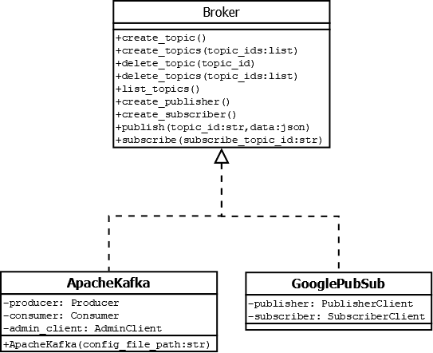
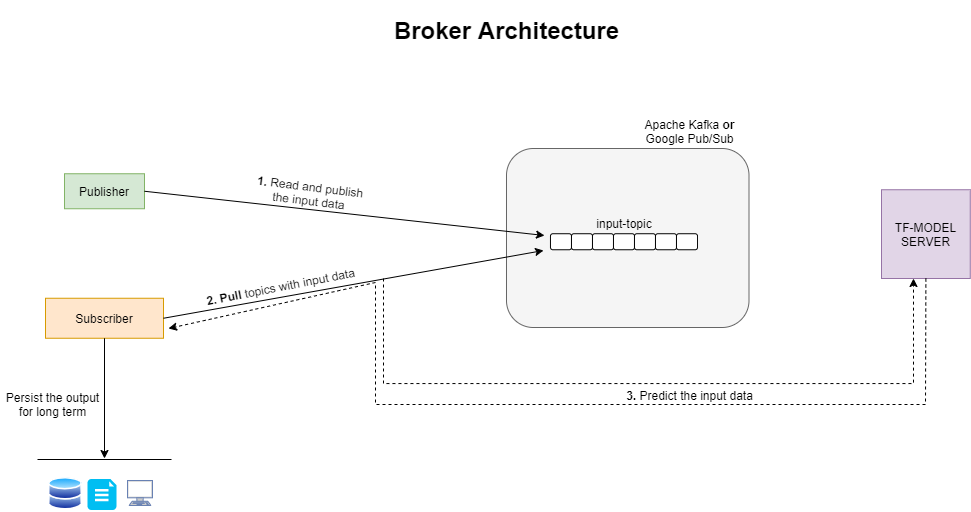

# fashion-mnist-pub-sub-ml-app
A Publisher Subscriber based ML application predicting fashion-mnist images through Apache Kafka or Google PubSub

**Language:** python

**Requirements:** docker, git

**Everything else:**

The following containers are pulled automatically in [Step 2](https://github.com/sathyarr/fashion-mnist-pub-sub-ml-app/blob/main/README.md#how-to-run) below:

- confluentinc/cp-kafka _(kafka cluster)_
- confluentinc/cp-zookeeper _(dependency of above image)_
- sathyarrr/fashion-mnist-pubsub _(actual app)_

### sathyarrr/fashion-mnist-pubsub:
On top of ubuntu image,
-	GooglePubSub emulator _installed_
-	Google Cloud SDK, python, Java _installed_
-	TensorFlow model server _installed_
-	All required python packages _installed_
---

## How to run?

**Step 1:** Clone the repository. Delete `.gitkeep` files under _workdir_ folders. They are used only to commit empty directories to git.

**Step 2:** Open the terminal from root of the repo.

Download required containers and get the shell of app’s container

`docker compose run my-app`

The working directory at this stage is _/my-app/app_

Start the TensorFlow model server in background:
```
nohup tensorflow_model_server \
--rest_api_port=8501 \
--model_name=fashion-model \
--model_base_path="/my-app/fashion-models" &
```

Start the GooglePubSub emulator in background:

`nohup gcloud beta emulators pubsub start --project=meow &`

Initialize the brokers:

`python3 -u initialize_broker.py`

Start the Publisher in background:
```
nohup python3 -u publisher.py \
--input '/my-app/workdir/input-images' \
--published '/my-app/workdir/published-images' &
```

Start the Subscriber in background:
```
nohup python3 -u subscriber.py \
--output '/my-app/workdir/predicted-images' \
--url 'http://localhost:8501/v1/models/fashion-model:predict' &
```

  *At this stage, `jobs -l` should say 4 jobs are Running.

**Step 3:** Use the tools in [Part 1](https://github.com/sathyarr/fashion-mnist-pub-sub-ml-app/blob/main/README.md#part-1) below to give inputs

By default, GooglePubSub broker is configured to run. It can be changed to ApacheKafka with `ML_APP_BROKER` environment variable. _Ref:_ [How it Works?](https://github.com/sathyarr/fashion-mnist-pub-sub-ml-app/blob/main/README.md#how-it-works)

The running publisher and subscriber should be killed(`kill %[Job ID]`) before updating the environment variable and are restarted

---
## How is it structured?

### Part 1:
#### Components:
**TensorFlow-model-server:** used to serve ML models in production
-	Multiple models are easily managed
-	Multiple versions of models are managed as well
-	Support gRPC and REST APIs
-	Intuitive Endpoint: POST http://host:port/v1/models/${MODEL_NAME}[/versions/${VERSION}|/labels/${LABEL}]:predict

#### Tools:
**app/trainer.py**
-	Generates a new fashion-mnist model based on CNN for the given data
-	Trained model can be exported after looking at the accuracy
-	If the export path is tf-model-server’s root, the model will be immediately served

***Usage:***
```
python3 trainer.py \
--images '/my-app/train-data/train-images-idx3-ubyte.gz' \
--labels '/my-app/train-data/train-labels-idx1-ubyte.gz' \
--export '/my-app/fashion-models'
```

**app/ubyte_to_png.py**
-	Converts the fashion-mnist dataset _(idx3-ubyte.gz)_ into actual image _(.png)_
-	Number of images to convert are specified by start, end index (actual dataset has >10k images)

***Usage:***
```
python3 ubyte_to_png.py \
--images '/my-app/test-data/t10k-images-idx3-ubyte.gz' \
--labels '/my-app/test-data/t10k-labels-idx1-ubyte.gz' \
--output '/my-app/workdir/input-images' \
--start 0 \
--end 4
```

### Part 2:
#### Components:
Brokers for the Publisher Subscriber model:
- [Google Pub/Sub emulator](https://cloud.google.com/pubsub/docs/emulator)
- [Apache Kafka Cluster(Docker)](https://developer.confluent.io/get-started/python#kafka-setup)

_(Both are On-premise applications and don’t interact with Cloud)_

#### Unified API:
 
 

-	GooglePubSub and ApacheKafka inherits a common abstraction
-	Both are interchanged seamlessly in the application layer
-	GooglePubSub speaks to its emulator while ApacheKafka speaks to its cluster (Docker) internally


### Part 3:
 
 

The model from [Part 1](https://github.com/sathyarr/fashion-mnist-pub-sub-ml-app/blob/main/README.md#part-1) and the library from [Part 2](https://github.com/sathyarr/fashion-mnist-pub-sub-ml-app/blob/main/README.md#part-2) are used to build a Machine Learning application.

#### How it Works?
**initialize_broker.py**
-	Initializes both GooglePubSub and ApacheKafka
-	Creates required topic _(input-topic)_ in both the broker systems

***Usage:*** `python3 -u initialize_broker.py`

The environment variable `ML_APP_BROKER` says which of the two brokers to use in the running application.

_Possible values:_ `google-pubsub` or `apache-kafka`

**publisher.py**
-	Keeps watching _workdir/input-images_ directory for new images
-	If an image is available, its data is published to _input-topic_ as numpy array
-	Once published, the images are moved to _workdir/published-images_ directory

***Usage:***
```
nohup python3 -u publisher.py \
--input '/my-app/workdir/input-images' \
--published '/my-app/workdir/published-images' &
```
_*(ubyte_to_png.py is used to fill workdir/input-images with new images)_

**subscriber.py**
-	When a new message is available at _input-topic_, it is subscribed
-	The data (numpy array) in the message is predicted against Tensorflow model server
-	The image is constructed from numpy array and is again stored in _workdir/predicted-images_ directory
-	The result class of the data is appended to the name of the image

(e.g., 0.png -> 0-_Shirt_.png)

***Usage:***
```
nohup python3 -u subscriber.py \
--output '/my-app/workdir/predicted-images' \
--url 'http://localhost:8501/v1/models/fashion-model:predict' &
```

The Publisher and Subscriber runs infinitely in the background doing their job.

**broker_tester.py**

Contains unit test cases to validate the Brokers.

---
### Note:
- Almost all python utilities have `--help` to know more about the arguments
- On restart, existing topics of Google emulator will get deleted
- Apache Kafka holds all the created topics unless explicitly deleted by creating a new container of docker

### Known:
- Duplicate inputs are not taken care. The results will just be overwritten
- If the data subscribed and not successfully predicted against tf-model-server, then it is lost
